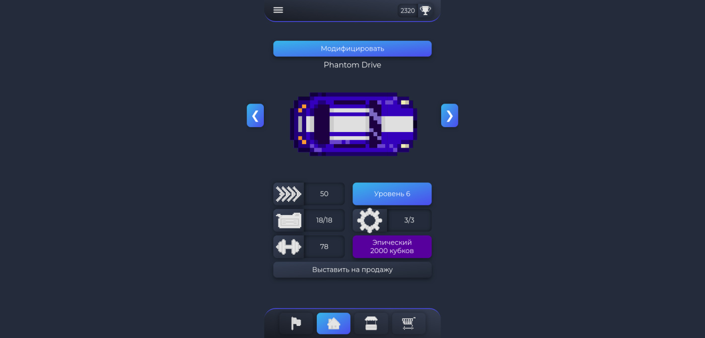
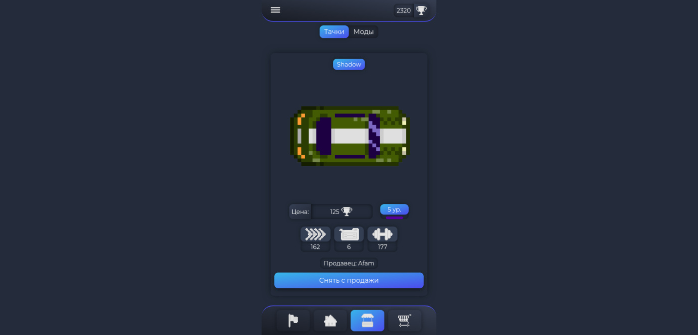
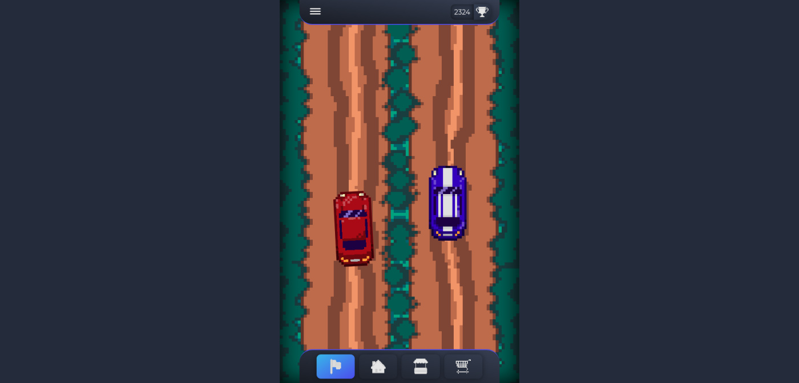

# 🏎️ Nitro Rush - Гоночная игра

Веб-приложение для виртуальных гонок с системой покупки машин и участия в заездах

## 🌐 Demo

[На VPS](http://155.212.147.12/)

## 📸 Скриншоты

### Домашняя страница

### Рынок

### Гонка

# 🚀 Запуск

# 1. Клонирование репозитория

    git clone https://github.com/Afam46/Nitro-Rush.git
    cd Nitro-Rush
    cp .env.example .env

# 2. Установка зависимостей

    composer install
    npm install

# 3. Настройка базы данных

    # Отредактируйте файл .env, указав настройки базы данных:
    
    DB_DATABASE=nitro_rush
    DB_USERNAME=root
    DB_PASSWORD=

# 4. Настройка приложения

    php artisan key:generate
    php artisan migrate
    php artisan db:seed
    php artisan app:update-shop

# 5. Запуск серверов

    # Терминал 1 - Основной сервер:
    php artisan serve

    # Терминал 2 - WebSocket сервер (для рынка):
    php artisan reverb:start

    # Терминал 3 - Фронтенд разработка:
    npm run dev

    # Терминал 4 - Redis (кеширование и очереди):
    sudo systemctl start redis
    php artisan schedule:work

    # Также для гонок нужно создать как минимум 2 аккаунта, иначе противник не подберется

# 🛠️ Дополнительные команды

    # Обновление магазина (автоматически каждый час или вручную):
    php artisan app:update-shop

    # Пополнение топлива игрокам (автоматически каждую минуту или вручную):
    php artisan app:fuel-up

## 🏗️ Архитектура

    Laravel API
    Vue SPA
    Reverb WebSocket server
    Redis cache
    MySQL database

⚡ Особенности игры

    ✅ Кастомизация - Покупайте и улучшайте машины
    ✅ Экономика - Зарабатывайте деньги за победы, тратьте на апгрейды
    ✅ WebSocket - Real-time обновления рынка
    ✅ Полная система аутентификации и регистрации
    ✅ Адаптивный дизайн
